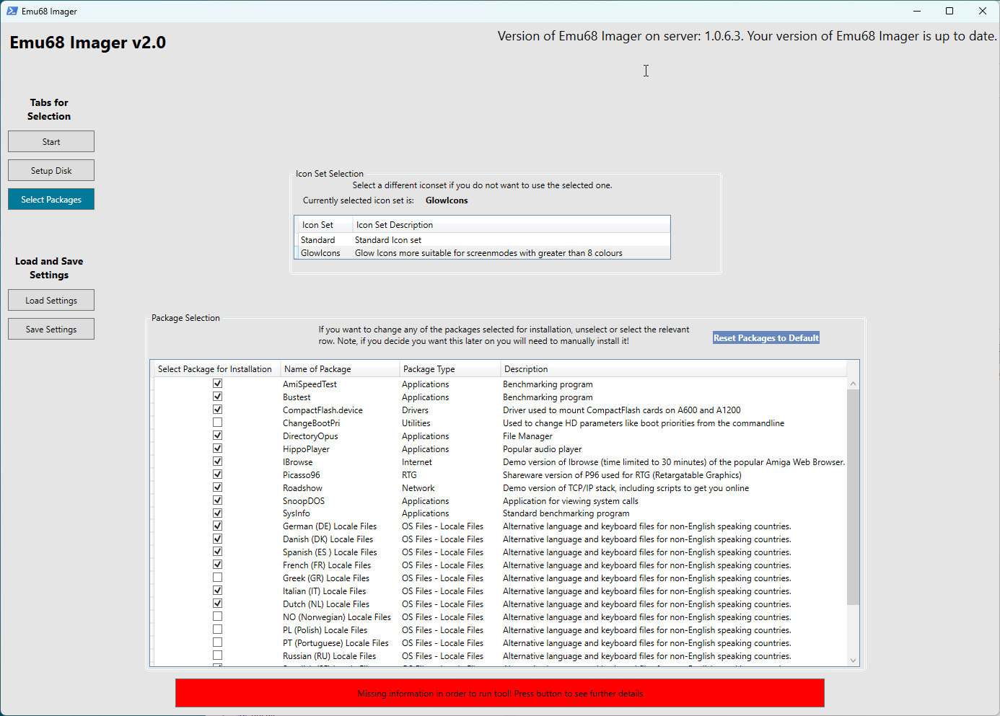

# Instructions - Emu68 Imager Version 2.x

When you first start the tool you will be presented with a window to select simple or advanced mode with a description for each mode. Select the mode you wish to use.

## Simple Mode

This will provide basic functionality only in order to create an image with as little customisation as possible.

## Advanced Mode

This will provide full functionality including full control over disk partitioning.

## Running the Tool

Once you have selected the mode you will be presented with the start screen. Each tab (shown on the left) will take you to a different page

### Start

This the start page which provides quick guidance as well as a link to this documentation.

### Setup Disk

This is where you set up the disk you wish to write to. There are a few different things to do:

#### Disk Type

This is where you define if you want to write to either a SD card or to an Image which you can then write to at a later date. If you change your mind after you begin configuring the disk/image you will need to redo this part!

If you select a Disk you will need to select the particular disk you wish to write to. Only removable media attached to your PC will be available for selection.

If you select an image, you will need to define the following:
- Image Size: The size of the image you want to create
- Image Location: Where you wish to save the image. When you save the image you are provided with two different image types to save, a .vhd file or a .img file. A .img file is the fixed size of the image. For example, if you select 32GiB you will need 32 GiB of space to save the file. This is the most compatible image format and should work regardless of the software you use to mount and write the image. Alternatively, you can use a .vhd file which will dynamically resize based on the contents of the image. This has the advantage that even a large sized image will only take up as much space as the data within. However, not all software will recognise this format - though it is recognised both in WinUAE and Windows. 

#### Partitioning

This is where you set up the disk in accordance with how you wish. There are two levels of partitioning, the MBR partitions and the Amiga Partitions.

MBR partitions are what the Raspberry Pi recognises when you boot the Amiga and Emu68 loads. Emu68 loads files from a FAT32 partition. Additionally, MBR partitions with the Partition ID of 0x76 are identified by Emu68 as being separate Amiga drives. Note, there can be a maximum of 4 MBR partitions. This is a limitation of the MBR structure, not Emu68.

By default, the Emu68 Imager creates one FAT32 partition and one 0x76 partition. If you wish, you can resize, move, delete, and add partitions. However, you are limited to the maximum of four MBR partitions.

If you click on any of the 0x76 partitions you will then see the Amiga partitions included within the 0x76 partition. Again, you can resize, move, delete and add partitions as you see fit. Should you wish you can also define the parameters of the partition including device, volume name, etc. - as you would if you were using HDToolbox on the Amiga. You can have a maximum of 10 Amiga partitions within the 0x76 partition. This is not a limitation of AmigaOS - rather it's placed within Emu68 Imager such that the interface does not become unwieldy! 

You also have the option of importing files from your PC to the partition. However, you are limited to importing single folders which will then import all files and folders underneath that folder. Each Amiga partition can have files imported to it. 

If you want to set up your owm environment you can delete the default Workbench partition. However, you will need to restart the set up process should you change your mind. 

if you have more granular requirements, you can of course use WinUAE, HST Imager, DiskFlashback, etc. to copy individual files directly to the partition.

### Configure Emu68

This is where you set up the environment you wish to install.

#### OS Selection

The imager tool supports five flavours of AmigaOS:
- 3.1 
- 3.2
- 3.2.2.1
- 3.2.3
- 3.9

Version 3.1 was originally supplied with the Amiga 1200 and 4000, and is still available from Cloanto as part of their Amiga Forever package. 

AmigaOS 3.9 was created by Haage & Partner. 

If you would like to update to the very latest AmigaOS, then Hyperion will sell you a copy of 3.2 on a CD ROM, with additional update and hotfix files as separate downloads. While 3.2.3 is the latest version, you can also install the base 3.2 version or 3.2.2.1 if you wish.

You need to select for which OS version you wish to install. Use the `Select OS Version` dropdown to select.

Irrespective of which version you select you will need the necessary Kickstart ROM and Workbench disk image files for which the tool will check you have the correct files.

The most essential part of the AmigaOS is the Kickstart, and one of the benefits of Emu68 is that you can use a different Kickstart version to the one physically installed inside your Amiga (currently the imager tool limits the option to three versions, but more may be available in future updates) - though obviously your Kickstart and Workbench versions should match. There are additional speed benefits also; any Kickstart file loaded by Emu68 is placed in fast RaspberryPi memory and is much, much faster to access - resulting in a snappier Workbench experience.

The second pre-requisite is the Workbench installation media. The imager tool expects that you will supply these media as disk images (.ADF files). You cannot use real floppy disks from an original workbench installation set with a PC floppy drive; they cannot be read. You can however use specialised hardware to make those images from real floppy drives using tools that you can get on Aminet, but that is beyond the scope of this document. Enquire with your friendly local Amiga web forum for more details.

The names of the ADF files and Kickstart ROMs are *not important*. You can name them anything since the imager tool will checksum and compare them to a database of known good disk and ROM images. This system prevents corrupt or altered installations from causing issues with your setup and ensures a hassle-free experience.

However, the actual contents of the files *is important*. You must use unmodified versions of these disks! 

#### Kickstart ROM files

The following table shows the Kickstart ROM files that are supported for the different versions of AmigaOS that are supported. Either copy the kickstart file to the default directory in the path where you have installed the tool (UserFiles\Kickstarts\) or select the directory where your ROM file is located by clicking on `Click to set Kickstart Path` button. It is recommended you use a local drive to do this, though network locations will work if you have the appropriate access rights. UNC links will not work due to limitations in one of the supporting tools (HST-Imager).

|**OS 3.1**                      |**OS 3.2**                     |**OS 3.2.2.1**                 |**OS 3.2.3**                   |**OS 3.9**                     |
|Kickstart 3.1 A1200 (40.068)    |Kickstart 3.2 A1200 (47.96)    |Kickstart 3.2.2 A1200 (47.111) |Kickstart 3.2.3 A1200 (47.115) |Kickstart 3.1 A1200 (40.068)   |
|Kickstart 3.x A1200 Cloanto     |                               |                               |                               |                               |

Please note that only A1200 versions of the Kickstart ROMs are supported as these are recommended for Emu68 regardless of the Amiga model you are using.

You will then need to click the `Check` button and the imager tool will then search this location and locate the correct Kickstart file based on its contents, so file names are not needed to match.

When the tool has searched for the Kickstarts, you will be provided with a message showing the Kickstart that has been located or a message advising you that the Kickstart cannot be found.

#### Workbench Media Install Images

All versions of AmigaOS apart from 3.9 are installed from ADF disk image files. 3.9 uses a CD .iso file along with the Boing Bag Update Archive (.LHA) files.

The following table details the files you will need for your chosen version of AmigaOS. As previously with the Kickstart ROM image, they will be matched by their contents so filenames are not needed to be correct. You can locate them wherever you like - keeping them alongside the Kickstart ROM file is a good idea. We recommend you copy your installation files to their own folder as simply pointing the tool at a large repository of Amiga system files (such as most users of say, WinUAE may have) can result in a long delay while the files are found.

For OS 3.2.2.1, the OS 3.2 standard ADFs are used along with the 3.2.2 updates and the 3.2.2.1 hot-fixes which are included in the 3.2.2.1 Hotfix package (while you can use the ADFs from 3.2.2, it is not necessary as the Hotfix package already includes them).

Either copy the required folders to the default directory in the path where you have installed the tool (UserFiles\ADFs\) or select the directory where the files exist (it will search all sub-folders under this directory) by clicking on `Click to set ADF Path` button. It is recommended you use a local drive to do this, though network locations will work if you have the appropriate access rights. UNC links will not work due to limitations in one of the supporting tools (HST-Imager).

|**OS 3.1**             |**OS 3.2**     |**OS 3.2.2.1** |              |                |**OS 3.2.3**   |                |**OS 3.9**             |        
|                       |               |*from 3.2*     |*from 3.2.2*  |*from 3.2.2.1*  |*from 3.2*     |*from 3.2.3*    |AmigaOS 3.9 CD ISO     | 
|Workbench 3.1          |Storage3.2     |Storage3.2     |DiskDoctor    |Update3.2.2.1   |Storage3.2     |Classes3.2.3    |Boing Bag 1 Update     |
|Workbench 3.1 Install  |Backdrops3.2   |Backdrops3.2   |Update3.2.2   |                |Backdrops3.2   |DiskDoctor3.2.3 |Boing Bag 2 Update     |
|Workbench 3.1 Storage  |Extras3.2      |Extras3.2      |Locale3.2.2-DE|                |Extras3.2      |Extras3.2.3     |                       |
|Workbench 3.1 Fonts    |Workbench3.2   |Workbench3.2   |Locale3.2.2-IT|                |Workbench3.2   |Locale-DE3.2.3  |                       | 
|Workbench 3.1 Extras   |Fonts          |Fonts          |Locale3.2.2-NL|                |Fonts          |Locale-DK3.2.3  |                       |
|Workbench 3.1 Locale   |Install3.2     |Install3.2     |Locale3.2.2-UK|                |Install3.2     |Locale-EN3.2.3  |                       |
|                       |Classes3.2     |Classes3.2     |Locale3.2.2-FR|                |Classes3.2     |Locale-ES3.2.3  |                       |
|                       |GlowIcons3.2   |GlowIcons3.2   |Locale3.2.2-DK|                |GlowIcons3.2   |Locale-FR3.2.3  |                       |
|                       |Locale         |Locale         |Locale3.2.2-EN|                |Locale         |Locale-IT3.2.3  |                       | 
|                       |Locale-DE      |Locale-DE      |Locale3.2.2-ES|                |Locale-DE      |Locale-SE3.2.3  |                       |
|                       |Locale-UK      |Locale-UK      |Locale3.2.2-SE|                |Locale-UK      |Locale-UK3.2.3  |                       |
|                       |Locale-NL      |Locale-NL      |              |                |Locale-NL      |Update3.2.3     |                       |
|                       |Locale-EN      |Locale-EN      |              |                |Locale-EN      |                |                       |
|                       |Locale-DK      |Locale-DK      |              |                |Locale-DK      |                |                       |
|                       |Locale-ES      |Locale-ES      |              |                |Locale-ES      |                |                       |
|                       |Locale-IT      |Locale-IT      |              |                |Locale-IT      |                |                       |
|                       |Locale-FR      |Locale-FR      |              |                |Locale-FR      |                |                       |
|                       |Locale-SE      |Locale-SE      |              |                |Locale-SE      |                |                       |
|                       |DiskDoctor     |               |              |                |               |                |                       |

The tool will then search the location you have specified and match to the relevant ADFs required (irrespective of the filenames). If you run into any issues where the tool notes there are missing ADFs, yet you have these available, check that the versions you have used are unmodified. Certain tools (e.g. DiskFlashback) were noted as causing modifications to the ADF, that while still useable, could cause the tool not to recognise them. If this happens, try copying the originally supplied ADFs to the folder.

> **NOTE:** ADF images from the Escom Amiga distribution are missing, among other things, language files (keyboard layouts too) and some tools. These images, while usable, should be avoided - if Commodore or Cloanto ADF images are available then the imager tool will prioritise their use over those from Escom.

You will then need to click the `Check` button and the imager tool will then search this location and locate the correct Kickstart file based on its contents, so file names are not needed to match.

When the tool has searched for the Installation Files you will be provided with a message showing the files that have been located along with any that are missing as shown below:

You will need to copy any missing Install files such as ADFs to the location you have used and run the check process again. Common reasons ADFs could be noted as missing include:
- The file is missing
- The file you have used has been modified
- You do not have the correct version of the file (e.g. you are installing 3.2.2.1 but have the DiskDoctor ADF from 3.2)

#### Selecting Screen mode of the HDMI output

This allows you to specify which screen resolution you want the Raspberry Pi to output once Emu68 has started. All Amiga screen modes used via the RTG system will be scaled to this output - if you choose 1920x1080 for the Pi, and use a 640x512 RTG workbench resolution then this will be scaled up to 1080p, for example, and may result in either a blurry filtered display (or jagged uneven pixels if you disable filtering later on in the RTG driver's Icon Information). It is advisable to either select the resolution that is native to your display, or the one that closely matches your intended Workbench screen mode. 

By default the tool will select the Automatic mode where the Raspberry Pi uses DLDI information from your display device to choose the best one. If you intend to use a HDMI switcher or similar device, then the Pi may not be able to determine the correct resolution. In this case you can choose one of the pre-selected resolutions.

Please note, the output of your RaspberryPi is fixed after boot, and cannot be changed without altering the config.txt file on the FAT32 partition.

#### Configuring WiFi

The imager tool gives you the option of configuring the Emu68 WiFi driver (wifipi.device) at install time, such that wifi will be available immediately the Amiga has booted. You need to enter the SSID (name) for your WiFi access point and the Password for it in the `Wifi Settings` section. Note this is case sensitive!

Please bear in mind that your wifi name and password are stored on the image should you use this option! It is not mandatory to provide this information during the tool setup, and you can set it up or change it later on by using the **Wifi Config** icon in the **PiStorm** folder on your Workbench partition.

### Select Packages

This screen allows you to customise what is installed. You can choose between different icon sets where available (e.g. Standard versus GlowIcons). Additionally, if you want to customise which software is installed you can add/remove certain options. For example, if your language is not selected by default then you can choose to install it (as well as unselecting languages you do not wish to install). Take care when uninstalling things you might later need!

### Load and Save Settings

There is an option to load and save settings. This will allow you to save the settings entered in this screen in case you need to go back and rerun. As well as saving your settings here, a settings file will automatically be created and stored in the Settings folder where you have installed the tool. This means if you ever need to re run the install (e.g. the install fails for any reason) you can load the previous settings and re-run.

## Writing the Image to the SD Card

Once all the options have been set to your satisfaction, the `Run Tool` button will turn green and when clicked, the process can begin.

If you have selected all the required options but the button is yellow it means you lack the required space to run the tool. Either select the `Click to set custom Working Folder` button above or press the yellow button and you will be prompted to select a new location for the Working Folder with sufficient space.

First, some information popup windows will inform you of what the tool is about to do (some may take some time to appear, please wait!) and then a summary page will be displayed.

After this the process shall begin.

The main output will be a Powershell window - a text display of progress. 

There are several sections where the imager tool downloads all necessary packages from the internet. 
Finally, the image will be written to the SD Card and when finished you can eject it and remove it from the drive.

Now you can insert the SD Card into RaspberryPi on your Amiga and continue with the [Amiga Utilities instructions](amigautilities.md)!
