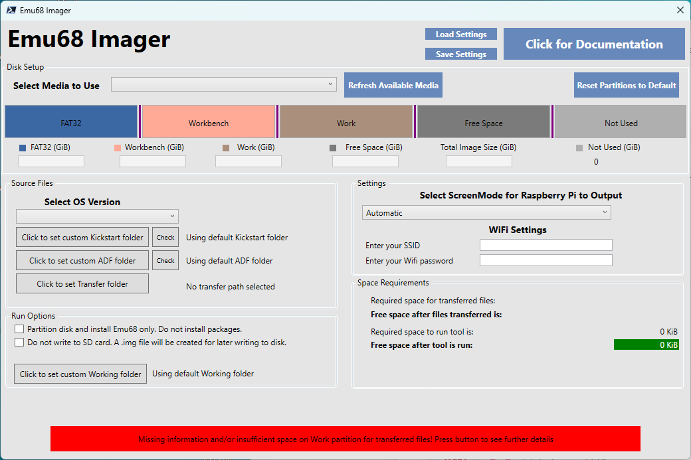

[Quick Start](#quick-start)

[Emu68 Imager tool instructions](#emu68-imager-tool-instructions)

[Amiga Utilities instructions](#amiga-utilities-instructions)

When you start the Emu68 Imager you will be presented with the options screen:

The **Run Tool** button will be red until you select the required options. When you select those it will turn green and you can press it.

### Quick Start

If you want to quickly create an image for your Pistormed amiga then you can leave most things on their default setting and do the following:
- Insert your SD card in your SD card reader
- If you inserted the SD card after the tool was run then press the **Refresh Available Media** button
- Select the desired SD card from the drop down control
- Select the desired OS version
- Copy the Kickstart ROM and all installation ADF floppy images to a folder on your disk (refer to [ADF Images](#adf-images) section)
- Select the Kickstart folder by clicking on **Click to set Kickstart Path** button
- Select the ADF Images folder by clicking on **Click to set ADF Path** button
- Select the Screen Mode of your HDMI monitor in the drop down box
- The button **Run Tool** should turn green if there was enough space on your disk
- Press the **Run Tool** button and follow the popup windows to start the tool
- It will take some time for all utilities to be downloaded and image written

## Emu68 Imager tool instructions

The tool has several sections. You will need to select options in each section for the tool to be able to run. When everything that is mandatory is selected the **Run Tool** button will turn green and you can continue with the image creation.

At any time you can click on **Click for Documentation** button which will show this instructions in your default browser.

## Selecting SD card

You can insert the SD before you start the tool. If you insert the SD card or change it while the tool is running you have to press the  **Refresh Available Media** button so the drop down box is refreshed.
Select the desired SD card from the **Select Media to use** drop down box. When you do so the partition bar will change accordingly.

**Reset Partitions to default** button will reset the partitions to their default values as if you selected the SD card for the first time.

## Selecting Parititon sizes

The tool will select the partition sizes to some reasonable default values. You can change any partition size to your liking. There are 5 parts on the partition bar:

# Fat32

### Amiga Utilities instructions

test text 2
