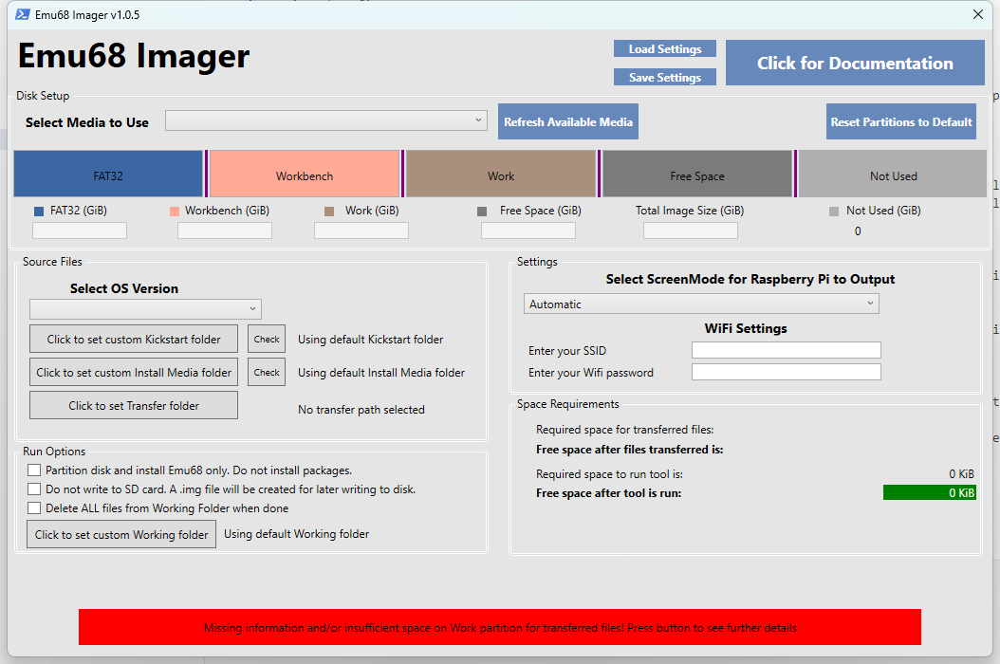

# Emu68 Imager tool instructions

When you start the Emu68 Imager you will be presented with the options screen:

The `Run Tool` button will be red until you select the required options. When you select those it will turn green and you can press it.

The tool has several sections. You will need to select options in each section for the tool to be able to run. When everything that is mandatory is selected the `Run Tool` button will turn green and you can continue with the image creation.

At any time you can click on `Click for Documentation` button which will show this instructions in your default browser.

## Selecting SD card

You can insert the SD card before you start the tool. If you insert the SD card or change it while the tool is running you have to press the  `Refresh Available Media` button so the drop down box is refreshed.
Select the desired SD card from the `Select Media to use` drop down box. When you do so the partition bar will change according to the capacity of the SD card. 

If you change the default sizes of the partitions then the `Reset Partitions to default` button will reset the partitions to their default values as if you selected the SD card for the first time.

## Selecting Parititon sizes

The tool will set the partition sizes to some reasonable default values. You can change any partition size to your liking. To resize a partiton you can click on the desired bar and drag it left/right to resize or you can enter the desired values in the text boxes below the bar. If you enter invalid values the text box background will turn red.
If you want to resize Fat32 or Workbench partitions then you will have to first *shrink* the Work partition (the Work partition gets most space by default). This will give you some **Not Used** space and you can resize other partitions to your liking.
There are 5 parts on the partition bar:

## Fat32

This is the boot partition for the raspberry Pi. It contains the Emu68 image and all necessary files for it to function. Additionally it contains the following:
- Kickstart image for your Amiga
- config.txt file with configuration of your pistorm and raspberry Pi
- cmdline.txt file with configuration of the Emu68
- Kickstarts folder to which you can copy the Kickstarts you want to use with WHDLoad games and demos
- Packages folder to which you can copy Install Packages for the Emu68 Imager tool package installer

The miniumum size of the Fat32 partition is 35MiB and it can be upto 4GB big. The tool selects the default size according to the capacity of the SD card. 

## Workbench

This is the boot partition for your Amiga. It will contain the Workbench installation and all tools and utilities that are necessary.
In addition to the installation folders that are installed with the OS you chose there are the following two folders created:
- Pistorm - contains all tools associated with Pistorm and Emu68
- Programs - contains essential utilities that we thought will benefit the user on clean install

Please refer to [Amiga Utilities instructions](amigautilities.md) about the content of these two folders.

The Workbench partition can be up to the maximum size allowed by the PFS file system (101 GiB). The tool selects the default size according to the capacity of the SD card. 

## Work

The Work partition is the one that will use up most of the capicity of your SD card. It should be used to install any programs for your Amiga.
You can populate some (or all) of it using the Imager tool from the start. Please refer to the [Supplying additional files that you want to have available](#supplying-additional-files-that-you-want-to-have-available) section on how to do that. If you don't populate it using this functionality then it will be empty.

The Work partition will by default take up all the remaining capacity of your SD card. Since the PFS3 partitions on the amiga can only be upto 101GiB in size the tool will create multiple Work partitions of equal size if your SD card has more capacity than the PFS limit. Only the first Work: partition will be formatted, you will need to format the rest yourself on the amiga. Please refer to [First Time Run](amigautilities.md#first-time-run) section on how to do that.

## Free Space

The Free Space is the space that will be available as "Free" on your amiga - HD Tool Box will be able to repartion and use it as you wish.
It is recommended to resize your Work partition so that there is no Free Space since the *free space* WILL be written to your SD card (it will take time to write it).

## Not Used

The Not Used is the part of the SD card that will not be touched and it will NOT be available on your amiga. If you would like to have smaller image on the amiga and have some free space which you can Repartion on your windows (to have another Fat32 or NTFS volume for PC use for example) then please use this *not used* space for it.

Press the `Reset Partitions to default` button to reset the partition sizes to default values.

## Supplying Kickstart ROM and Workbench installation floppies

Essential part of the Amiga Operating system are the Kickstart rom which is normally inside a chip in your amiga and installation floppies for Workbench.
Pistorm and Emu68 are able to load the Kickstart ROM from the SD card. There are two advantages:
- When ROM is loaded from the SD card it will use the fast memory of rPI instead of slow memory on the amiga chip
- You can change the loaded ROM at any time without having to change the chip inside the amiga
Workbench used to be supplied on floppy disks but today you will get it on other modern media in form of ADF disk images. You can also make those images from real floppy drives using tools that you can get on Aminet.

Emu68 Imager supports two versions of Amiga OS: 3.1 and 3.2.2.1 . 3.1 is the OS that was supplied with Amiga 1200 and 4000. It is still being sold by Cloanto where you will get it in the form of ADF images. 3.2.2.1 is the latest version of Amiga OS and is still being developed by Hyperion. You will get it in form of ADF files on CD-ROM when you buy it. Both distributions also include the Kickstart ROM file which you need to supply.

The names of the ADF files and Kickstart ROMs are not important. You can name them anything since we do checksums and compare them to our database. This way only supported, uncorrupted and unaltered ROMs and floppy images are supported.

First you need to select for which OS version you will provide the needed files. Use the `Select OS Version` dropdown.

## Kickstart ROM files

The following Kickstart ROM files are needed for each OS that is supported. Place them in any directory on your hard drive and select that directory by clicking on `Click to set Kickstart Path` button.

|**OS 3.1**|**OS 3.2.2.1**|
|Kickstart 3.1 A1200 (40.068) Hyperion|Kickstart 3.2.2 A1200 (47.111)|
|Kickstart 3.1 A1200 (40.068) Commodore||
|Kickstart 3.x A1200 Cloanto||

## Workbench ADF Install Images

The following ADF files must be provided for each OS. You can place them in the same directory as Kickstart ROM or a separate one.

For OS 3.2.2.1 make sure to use the latest version ADF file if the name does not include version number! First are the files from 3.2 distribution then the files from 3.2.2 Update and last the file from 3.2.2.1 Hotfix.

Select the directory where you placed the files by clicking on `Click to set ADF Path` button.

|**OS 3.1**               |**OS 3.2.2.1**| ||
||*from 3.2*|*from 3.2.2*|*from 3.2.2.1*|
|Workbench 3.1        |Storage 3.2|  DiskDoctor 3.2.2|Update 3.2.2.1|
|Workbench 3.1 Install|Backdrops 3.2|Update 3.2.2||
|Workbench 3.1 Storage|Extras 3.2|   LocaleDE 3.2.2||
|Workbench 3.1 Fonts  |Workbench 3.2|LocaleIT 3.2.2||
|Workbench 3.1 Extras |Fonts 3.2|    LocaleNL 3.2.2||
|Workbench 3.1 Locale |Install 3.2|  LocaleUK 3.2.2||
||Classes 3.2|                       LocaleFR 3.2.2||
||GlowIcons 3.2|                     LocaleDK 3.2.2||
||Locale 3.2|                        LocaleEN 3.2.2||
||LocaleDE 3.2|                      LocaleES 3.2.2||
||LocaleUK 3.2|||
||LocaleNL 3.2|||
||LocaleEN 3.2|||
||LocaleDK 3.2|||
||LocaleES 3.2|||
||LocaleIT 3.2|||
||LocaleFR 3.2|||

## Supplying additional files that you want to have available

If you want to supply your own files that you want to have available in the Work: partition then you can do so by clicking on the `Click to set transfer path` button.
You can put any files you want there and they will be copied to the SD card into the Work: partition.
The Imager tool will check the sizes if they fit and will warn you if there is not enough space.

## Selecting Screen mode of the HDMI output

The output of your raspberryPi stays fixed from the boot and the same resolution is used by the RTG driver on the Amiga. The resolution that you pick from the Screen Mode preferences is then stretched/shrinked to the resolution you picked for the RaspberryPi. In the Settings group you can select one of the pre-defined resolutions or let it be Automatically selected by the Pi on boot. 
If you want to change it later you can edit the config.txt file on fat32 partition accordingly.

## Configuring WiFi

Imager lets you configure WiFi driver of Emu68 (wifipi.device) before the Workbench is started. You need to enter the SSID (name) of your WiFi endpoint and the Password for it. Both are in the `Wifi Settings` section. You can change them later on by using the **Wifi Config** icon in the **Pistorm** folder on your Workbench partition.

## Options

Option **Set disk up only. Do not install packages.** will not install anything on the Workbench partition, it will only create the partitions and format them.

Option **Do not write to disk. Produce image file only.** will create an .IMG file on your drive (in folder "Working Folder/Output Files") and will not write anything to the SD card. You can write the .IMG file to the SD card later with any image writing program.

## Space Requirements

In this section you can always see how much space is required on your disk for the temporary files that are created when creating the image. You can also see how much space is required on the Work: partition for any addiitonal files you want to write to it. 
