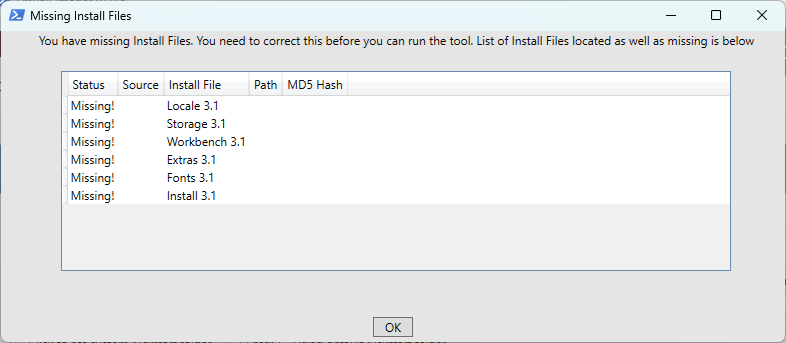

# Emu68 Imager tool instructions

This is a more detailed description of the options available to you in the image creation tool, and should be studied closely if you want to take full advantage of the flexibility it offers.

It should be noted that the Imager tool requires Administrator access rights - it cannot manipulate media devices without it. It is safe to use, but as always - handle with care. The Tool is self-elevating, so grant access when you run it.

When you start the Emu68 Imager this window will be displayed after the credits and acknowledgements are shown:

The `Run Tool` button will remain red until you supply the required information. When these requirements are satisfied, the button will turn green, indicating that the tool is ready to run.

If the button turns yellow, it means that your current drive location does not have sufficient space. You will be given the option of defining a different working folder so you can select a location with additional space.

At any time you can click on `Click for Documentation` button which will show these instructions in your default browser. 
If you click the `Run Tool` button before it is ready, the tool will inform you of what information is missing.

## Load and Save Settings

There is an option to load and save settings. This will allow you to save the settings entered in this screen in case you need to go back and rerun. As well as saving your settings here, a settings file will automatically be created and stored in the Settings folder where you have installed the tool. This means if you ever need to re run the install (e.g. the install fails for any reason) you can load the previous settings and re-run.

Note, when you load settings you must have the SD card you used available if you wish to restore the partition sizes from the loaded settings file. If the SD card is not available then the partition sizes from the settings file will not be loaded. However, all your other settings (e.g. OS selection, path to ADFs, etc.) will be loaded.

You will need to re-run the check for the Kickstart and ADF files.

## Selecting an SD card

The tool will list all available media in the drop-down box at the top of the window. The list is filtered to removable media and will include any drives which are suitable for use, but do exercise caution when choosing as this process is irreversible. Removable media will also include any attached USB drives so please ensure you select the actual SD card you intend to use.

If you insert or change the media while this window is open, you can click on `Refresh available media` to update the list. 

## Selecting Partition sizes

After selecting a suitable SD card, the partition bar will populate with some reasonable default values based on the size of your card. You can then change the sizes of each partition to meet your needs. Resizing is simple; just drag the solid bar between partitions to change them. Note that for very large cards, this may not be practical as the partitions will appear quite small (particularly for the FAT32 and Workbench partitions). In this case you may find that you prefer to enter their sizes in the text fields below.
Invalid partition sizes will show as a red text field. 

N.B. If you want to resize the FAT32 or Workbench partitions then you will have to first *shrink* the Work partition (the Work partition gets most space by default). This will expand the **Not Used** space and you can resize other partitions into it.

There are 5 sections in the partition bar:

## FAT32

This is the boot partition for the Raspberry Pi. It contains the Emu68 system and all necessary files for it to function. Additionally it contains the following:

- The Kickstart image for your Amiga.
- A config.txt file with configuration information for your PiStorm and Raspberry Pi.
- A cmdline.txt file with configuration information for Emu68.
- A Kickstarts folder to which you can copy the Kickstarts you want to use with WHDLoad games and demos. This is optional and not required to use the tool.
- A Packages folder where you can copy Install Packages for the Emu68 Imager tool package installer. This is optional and not required to use the tool.

The miniumum size of the FAT32 partition is 35MiB, with a maximum of 4GiB. The imager tool will select the default size according to the capacity of the SD card.

## Workbench

This is the boot partition for your Amiga. It contains the Workbench installation, and additionally the following two folders:
- PiStorm - contains all tools associated with PiStorm and Emu68.
- Programs - contains essential utilities that we thought will benefit the user on clean install.

Please refer to [Amiga Utilities instructions](amigautilities.md) about the content of these two folders.

The Workbench partition can be resized up to the maximum size allowed by the PFS file system (101 GiB). As with the FAT32 partition, the imager tool selects the default size according to the capacity of the SD card. 

## Work

The Work partition is generally the largest of all the partitions on your SD Card, and it should be used to install any applications or games for your Amiga, along with your documents and other files.
Provision has been made to make additional files available as part of the installation created by the image tool - please refer to the [Supplying your own additional files](#supplying-your-own-additional-files) section on how to choose which of your files you would like to have pre-installed. If you don't populate the Work partition using this functionality then it will be empty.

The Work partition will, by default, take up all the remaining capacity of your SD card. Since the PFS3 partitions on the Amiga can only be up to 101GiB in size the tool will create multiple Work partitions of equal size if your SD card has more capacity than the PFS limit. 

Only the first Work: partition will be formatted, you will need to format the rest yourself on the Amiga. Please refer to [First Time Run](amigautilities.md#first-time-run) section on how to do that.

## Free Space

The Free Space is the space that will be available as "unpartitioned" on your Amiga - HD Tool Box will be able to repartition and use it as you wish.
It is recommended that you resize your Work partition so that there is no Free Space since the *free space* WILL be written to your SD card. 

## Not Used

Due to the nature of how Emu68's drivers work, the SD card will be physically partitioned as two MBR partitions recognised on your PC (or Mac) - one FAT32 partition and one partition marked as 0x76. The second partition will contain the partitions seen on your Amiga  (i.e. the Workbench and any Work partitions as detailed above). These two partitions can be sized such that their total size is smaller than your SD card - you may not want an entire 512GiB or 1TiB card devoted to the Amiga and may decide to use half of it as Windows or Mac storage space instead for use on other devices. In this case, the remaining space on the SD card will be "*Not Used*" and will be unavailable from within AmigaOS (though you can add additional 0x76 partitions for use on the Amiga, though this is outside the scope of the tool).

Press the `Reset Partitions to default` button to reset the partition sizes to default values.

## Supplying Kickstart ROM and Workbench installation floppy images (.ADF files)

The imager tool supports three flavours of AmigaOS:
- 3.1 
- 3.2
- 3.2.2.1

Version 3.1 was originally supplied with the Amiga 1200 and 4000, and is still available from Cloanto as part of their Amiga Forever package. 

If you would like to update to the very latest AmigaOS, then Hyperion will sell you a copy of 3.2 on a CD ROM, with additional update and hotfix files as separate downloads. While 3.2.2.1 is the latest version, you can also install the base 3.2 version if you wish.

You need to select for which OS version you wish to install. Use the `Select OS Version` dropdown to select.

Irrespective of which version you select you will need the necessary Kickstart ROM and Workbench disk image files for which the tool will check you have the correct files.

The most essential part of the AmigaOS is the Kickstart, and one of the benefits of Emu68 is that you can use a different Kickstart version to the one physically installed inside your Amiga (currently the imager tool limits the option to three versions, but more may be available in future updates) - though obviously your Kickstart and Workbench versions should match. There are additional speed benefits also; any Kickstart file loaded by Emu68 is placed in fast RaspberryPi memory and is much, much faster to access - resulting in a snappier Workbench experience.

The second pre-requisite is the Workbench installation media. The imager tool expects that you will supply these media as disk images (.ADF files). You cannot use real floppy disks from an original workbench installation set with a PC floppy drive; they cannot be read. You can however use specialised hardware to make those images from real floppy drives using tools that you can get on Aminet, but that is beyond the scope of this document. Enquire with your friendly local Amiga web forum for more details.

The names of the ADF files and Kickstart ROMs are *not important*. You can name them anything since the imager tool will checksum and compare them to a database of known good disk and ROM images. This system prevents corrupt or altered installations from causing issues with your setup and ensures a hassle-free experience.

However, the actual contents of the files *is important*. You must use unmodified versions of these disks! 

## Kickstart ROM files

The following table shows the Kickstart ROM files that are supported for the different versions of AmigaOS that are supported. Either copy the kickstart file to the default directory in the path where you have installed the tool (UserFiles\Kickstarts\) or select the directory where your ROM file is located by clicking on `Click to set Kickstart Path` button. It is recommended you use a local drive to do this, though network locations will work if you have the appropriate access rights. UNC links will not work due to limitations in one of the supporting tools (HST-Imager).

|**OS 3.1**                      |**OS 3.2**                     |**OS 3.2.2.1**                 |
|Kickstart 3.1 A1200 (40.068)    |Kickstart 3.2 A1200 (47.96)    |Kickstart 3.2.2 A1200 (47.111) |
|Kickstart 3.x A1200 Cloanto     |                               |                               |

Please note that only A1200 versions of the Kickstart ROMs are supported as these are recommended for Emu68 regardless of the Amiga model you are using.

You will then need to click the `Check` button and the imager tool will then search this location and locate the correct Kickstart file based on its contents, so file names are not needed to match.

When the tool has searched for the Kickstarts, you will be provided with a message showing the Kickstart that has been located or a message advising you that the Kickstart cannot be found.

## Workbench ADF Install Images

The following table details the ADF disk image files you will need for your chosen version of AmigaOS. As previously with the Kickstart ROM image, they will be matched by their contents so filenames are not needed to be correct. You can locate them wherever you like - keeping them alongside the Kickstart ROM file is a good idea. We recommend you copy your installation files to their own folder as simply pointing the tool at a large repository of Amiga system files (such as most users of say, WinUAE may have) can result in a long delay while the files are found.

For OS 3.2.2.1, the OS 3.2 standard ADFs are used along with the 3.2.2 updates and the 3.2.2.1 hot-fixe which are included in the 3.2.2.1 Hotfix package (while you can use the ADFs from 3.2.2, it is not necessary as the Hotfix package already includes them).

Either copy the required folders to the default directory in the path where you have installed the tool (UserFiles\ADFs\) or select the directory where the files exist (it will search all sub-folders under this directory) by clicking on `Click to set ADF Path` button. It is recommended you use a local drive to do this, though network locations will work if you have the appropriate access rights. UNC links will not work due to limitations in one of the supporting tools (HST-Imager).

|**OS 3.1**             |**OS 3.2**     |**OS 3.2.2.1** |              |                |
|                       |               |*from 3.2*     |*from 3.2.2*  |*from 3.2.2.1*  |
|Workbench 3.1          |Storage3.2     |Storage3.2     |DiskDoctor    |Update3.2.2.1   |
|Workbench 3.1 Install  |Backdrops3.2   |Backdrops3.2   |Update3.2.2   |                |
|Workbench 3.1 Storage  |Extras3.2      |Extras3.2      |Locale3.2.2-DE|                |
|Workbench 3.1 Fonts    |Workbench3.2   |Workbench3.2   |Locale3.2.2-IT|                |
|Workbench 3.1 Extras   |Fonts          |Fonts          |Locale3.2.2-NL|                |
|Workbench 3.1 Locale   |Install3.2     |Install3.2     |Locale3.2.2-UK|                |
|                       |Classes3.2     |Classes3.2     |Locale3.2.2-FR|                |
|                       |GlowIcons3.2   |GlowIcons3.2   |Locale3.2.2-DK|                |
|                       |Locale         |Locale         |Locale3.2.2-EN|                |
|                       |Locale-DE      |Locale-DE      |Locale3.2.2-ES|                |
|                       |Locale-UK      |Locale-UK      |Locale3.2.2-SE|                |
|                       |Locale-NL      |Locale-NL      |              |                |
|                       |Locale-EN      |Locale-EN      |              |                |
|                       |Locale-DK      |Locale-DK      |              |                |
|                       |Locale-ES      |Locale-ES      |              |                |
|                       |Locale-IT      |Locale-IT      |              |                |
|                       |Locale-FR      |Locale-FR      |              |                |
|                       |Locale-SE      |Locale-SE      |              |                |
|                       |DiskDoctor     |               |              |                |

The tool will then search the location you have specified and match to the relevant ADFs required (irrespective of the filenames). If you run into any issues where the tool notes there are missing ADFs, yet you have these available, check that the versions you have used are unmodified. Certain tools (e.g. DiskFlashback) were noted as causing modifications to the ADF, that while still useable, could cause the tool not to recognise them. If this happens, try copying the originally supplied ADFs to the folder.

> **NOTE:** ADF images from the Escom Amiga distribution are missing, among other things, language files (keyboard layouts too) and some tools. These images, while usable, should be avoided - if Commodore or Cloanto ADF images are available then the imager tool will prioritise their use over those from Escom.

You will then need to click the `Check` button and the imager tool will then search this location and locate the correct Kickstart file based on its contents, so file names are not needed to match.

When the tool has searched for the ADFs you will be provided with a message showing the ADFs that have been located along with any that are missing as shown below:

You will need to copy any missing ADFs to the location you have used and run the check process again. Common reasons ADFs could be noted as missing include:
- The file is missing
- The ADF you have used has been modified
- You do not have the correct version of the ADF (e.g. you are installing 3.2.2.1 but have the DiskDoctor ADF from 3.2)

## Supplying your own additional files

If you want to supply your own files - say, tools or data that you want to have available in the Work: partition, then you can do so by clicking on the `Click to set transfer path` button.
You can place any files you want in that location and they will be copied to the SD card into the Work: partition. It is recommended you use a local drive to do this, though network locations will work if you have the appropriate access rights and it is a mapped network drive. UNC links will not work due to limitations in one of the supporting tools (HST-Imager).

The Imager tool will check file sizes and will warn you if there is not enough space. 
N.B: this can take significant time to transfer if you have a large amount of files! 

## Selecting Screen mode of the HDMI output

This allows you to specify which screen resolution you want the Raspberry Pi to output once Emu68 has started. All Amiga screen modes used via the RTG system will be scaled to this output - if you choose 1920x1080 for the Pi, and use a 640x512 RTG workbench resolution then this will be scaled up to 1080p, for example, and may result in either a blurry filtered display (or jagged uneven pixels if you disable filtering later on in the RTG driver's Icon Information). It is advisable to either select the resolution that is native to your display, or the one that closely matches your intended Workbench screen mode. 

By default the tool will select the Automatic mode where the Raspberry Pi uses DLDI information from your display device to choose the best one. If you intend to use a HDMI switcher or similar device, then the Pi may not be able to determine the correct resolution. In this case you can choose one of the pre-selected resolutions.

Please note, the output of your RaspberryPi is fixed after boot, and cannot be changed without altering the config.txt file on the FAT32 partition.

## Configuring WiFi

The imager tool gives you the option of configuring the Emu68 WiFi driver (wifipi.device) at install time, such that wifi will be available immediately the Amiga has booted. You need to enter the SSID (name) for your WiFi access point and the Password for it in the `Wifi Settings` section. 

Please bear in mind that your wifi name and password are stored on the image should you use this option! It is not mandatory to provide this information during the tool setup, and you can set it up or change it later on by using the **Wifi Config** icon in the **PiStorm** folder on your Workbench partition.

## Options

**Partition disk and install Emu68 only. Do not install packages.** will not install anything on the Workbench or Work partitions, it will only create the partitions and format them.

**Do not write to SD card. A .img file will be created for later writing to disk.** will create an .IMG file on your drive (in folder "Working Folder\OutputImage") and will not write anything to the SD card. You can write the .IMG file to the SD card later with any image writing program such as Balena Etcher, etc.

These two options are mutually exclusive (i.e. you cannot select both)!

**Delete ALL files from Working Folder when done.** By default the tool will delete the files from the Working Folder when you start the tool. This prevents redownloading files you may already have from  previous use of the tool. However, these files can take up a lot of space (particularly the .HDF file used to create the Amiga partition on the SD card). Selection this option will delete all files from the Working Folder (with the exception of the .IMG file if you have chosen the 'Produce image file only' option above) at the conclusion of the running of the tool. Of course you can use Windows explorer to manually delete files and folders if you wish. 

**Click to set custom Working Folder** By default the tool will create and use a 'Working Folder' in the folder where you have installed the tool. If you need to define a different location (e.g. you have insufficient space on the drive) you can choose a a different location by pressing this button. This needs to be a local drive rather than a location on the network (including mapped network drives). 

## Space Requirements

In this section you can always see how much space is required on your disk for the temporary files that are created when creating the image. You can also see how much space is required on the Work: partition for any additional files you want to write to it. 
This field will turn red if there is insufficient space on your current working drive (usually the drive you launched the tool from). In this case you will be given the option of changing to a different drive/folder before the tool starts.

Note that you will need enough space for the .HDF  file *and* the downloaded setup files - in the case of a very large SD card this can be a  large amount of space. It is also recommended that you choose an SSD for this as access speed will be paramount in reducing the time needed to create the image prior to writing to the card.

## Writing the Image to the SD Card

Once all the options have been set to your satisfaction, the `Run Tool` button will turn green and when clicked, the process can begin.

If you have selected all the required options but the button is yellow it means you lack the required space to run the tool. Either select the `Click to set custom Working Folder` button above or press the yellow button and you will be prompted to select a new location for the Working Folder with sufficient space.

First, some information popup windows will inform you of what the tool is about to do (some may take some time to appear, please wait!) and then a summary page will be displayed.

After this the process shall begin.

The main output will be a Powershell window - a text display of progress. 

There are several sections where the imager tool downloads all necessary packages from the internet. 
Finally, the image will be written to the SD Card and when finished you can eject it and remove it from the drive.

Now you can insert the SD Card into RaspberryPi on your Amiga and continue with the [Amiga Utilities instructions](amigautilities.md)!
